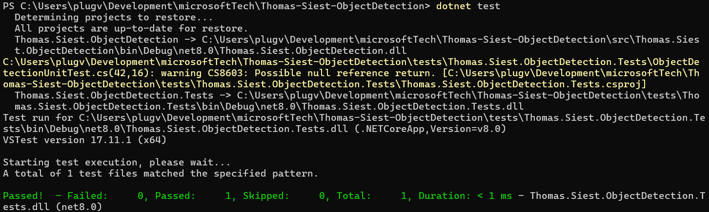
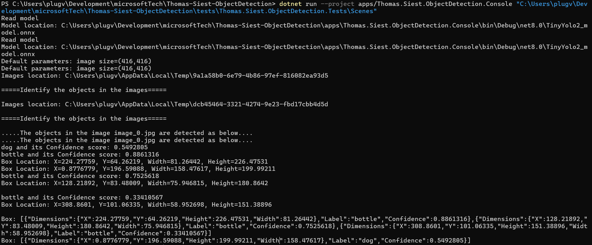

# Examen Microsoft Technologies 2025 - Thomas Siest
## Thomas-Siest-ObjectDetection

Ce projet est une implémentation de Object Detection en C#. Il contient :
- Une librairie pour détecter des objets dans des scènes.
- Une application console.
- Une API Web exposant les fonctionnalités.

## Lien GitHub
[Consultez le projet sur GitHub](https://github.com/plugveg/Thomas-Siest-ObjectDetection)

## Initiation de la solution (.sln) et création du projet librairie (3 points)
- Créer une solution (.sln) nommée `Thomas-Siest-ObjectDetection` via la commande `dotnet new sln -n Thomas.Siest.ObjectDetection`.
- Création du dossier src.
- Créer un projet librairie nommé `Thomas.Siest.ObjectDetection` via la commande `dotnet new classlib -n Thomas.Siest.ObjectDetection -o src/Thomas.Siest.ObjectDetection`.
- Ajouter le projet à la solution via la commande `dotnet sln add src/Thomas.Siest.ObjectDetection`.
- Création des 2 fichiers `ObjectDetection.cs` et `ObjectDetectionResult.cs` dans le projet librairie.
- Créer un fichier README.md à la racine du projet.
- Ajouter le gitignore via la commande `dotnet new gitignore`.

## Création d’un projet de test unitaire (4 points) 
- Création du dossier tests.
- Créer un projet de test unitaire nommé `Thomas.Siest.ObjectDetection.Tests` via la commande `dotnet new xunit -n Thomas.Siest.ObjectDetection.Tests -o tests/Thomas.Siest.ObjectDetection.Tests`.
- Ajouter le projet à la solution via la commande `dotnet sln add tests/Thomas.Siest.ObjectDetection.Tests`.
- Ajouter une référence vers le projet `Thomas.Siest.ObjectDetection` via la commande `dotnet add tests/Thomas.Siest.ObjectDetection.Tests reference src/Thomas.Siest.ObjectDetection`.
- Création du fichier `ObjectDetectionUnitTest.cs` dans le projet de test unitaire.
- Ajout du dossier `Scenes` avec les images de scènes à tester sous le nom `Thomas-Siest-scene-0.jpg` et `Thomas-Siest-scene-1.jpg`.
  - Ne pas oublier de copier les images dans le dossier de sortie du projet de test unitaire via le fichier `Thomas.Siest.ObjectDetection.Tests.csproj`.
  - Exemple :
  ```xml
    <ItemGroup>
    <None Update="Scenes\Thomas-Siest-scene-0.jpg">
      <CopyToOutputDirectory>PreserveNewest</CopyToOutputDirectory>
    </None>
    <None Update="Scenes\Thomas-Siest-scene-1.jpg">
      <CopyToOutputDirectory>PreserveNewest</CopyToOutputDirectory>
    </None>
  </ItemGroup>
    ```
  - PS: On peut aussi le faire via l'interface graphique de Rider (comme expliqué dans l'énoncé).

## Implémenter votre librairie de ObjectDetection (4 points) 
- Importer les dépendances nécessaires via NuGet.
  - Microsoft.ML version 4.0.0 
  - Microsoft.ML.ImageAnalytics version 4.0.0 
  - Microsoft.ML.OnnxRuntime version 1.20.1
  - Microsoft.ML.OnnxTransformer version 4.0.0
  - System.Drawing.Common version 9.0.0 
  - Commande : 
    - `dotnet add src/Thomas.Siest.ObjectDetection package Microsoft.ML --version 4.0.0`
    - `dotnet add src/Thomas.Siest.ObjectDetection package Microsoft.ML.ImageAnalytics --version 4.0.0`
    - `dotnet add src/Thomas.Siest.ObjectDetection package Microsoft.ML.OnnxRuntime --version 1.20.1`
    - `dotnet add src/Thomas.Siest.ObjectDetection package Microsoft.ML.OnnxTransformer --version 4.0.0`
    - `dotnet add src/Thomas.Siest.ObjectDetection package System.Drawing.Common --version 9.0.0`
- Copier les fichiers `TinyYolo2_model.onnx` et `Yolo.cs` dans le dossier `src/Thomas.Siest.ObjectDetection`.
- Configure le fichier `TinyYolo2_model.onnx` pour qu'il soit copié dans le dossier de sortie de l'application.
  - Exemple :
  ```xml
  <ItemGroup>
    <None Update="TinyYolo2_model.onnx">
      <CopyToOutputDirectory>PreserveNewest</CopyToOutputDirectory>
    </None>
  </ItemGroup>
  ```
  - PS: On peut aussi le faire via l'interface graphique de Rider (comme expliqué dans l'énoncé).
- Implémenter la classe `ObjectDetection` dans le fichier `ObjectDetection.cs`.
- Revoir les résultats des fichiers tests selon les images fournies.
## ATTENTION : lors de l'execution des tests unitaires, il est possible que le test unitaire ne passe pas du fait que les deux images soient checkées au même moment. Il est possible de les checker une par une pour voir si les tests passent.
### Voici la preuve que les tests passent :


## Création d’un projet console qui consomme votre librairie (3 points) 
Comme on prévoie d'ajouter une API Web, il est préférable d'adopter la structure avec un dossier apps, car cela permet une organisation plus nette.
- Créer un projet console nommé `Thomas.Siest.ObjectDetection.Console` via la commande `dotnet new console -n Thomas.Siest.ObjectDetection.Console -o apps/Thomas.Siest.ObjectDetection.Console`.
- Ajouter le projet à la solution via la commande `dotnet sln add apps/Thomas.Siest.ObjectDetection.Console`.
- Ajouter une référence vers le projet `Thomas.Siest.ObjectDetection` via la commande `dotnet add apps/Thomas.Siest.ObjectDetection.Console reference src/Thomas.Siest.ObjectDetection`.
- Implémenter la classe `Program` dans le fichier `Program.cs`.
- Tester via la commande `dotnet run --project apps/Thomas.Siest.ObjectDetection.Console "C:\Users\plugv\Development\microsoftTech\Thomas-Siest-ObjectDetection\tests\Thomas.Siest.ObjectDetection.Tests\Scenes"`
  - PS: Il est possible que le chemin soit différent selon l'ordinateur.
### Voici la preuve que le projet console fonctionne :

